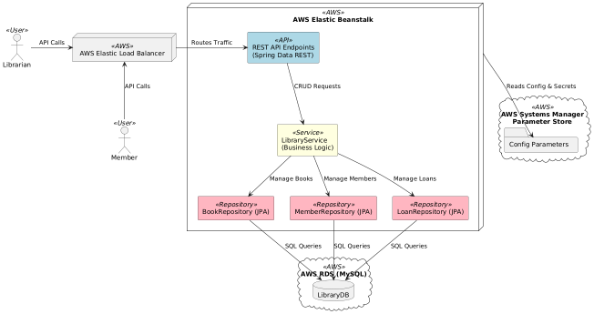
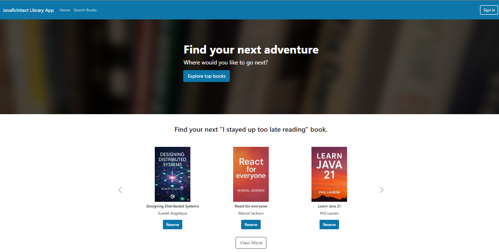

# 📚 Full Stack Library Web Application

A **full stack** web application built with **React** (Bootstrap UI) and **Spring Boot (Java 17)**, enabling asynchronous communication between the frontend and backend.
The system allows users to browse, borrow, and manage books, with secure API integration and cloud deployment on **AWS Elastic Beanstalk** backed by **Amazon RDS**.

---

## 🚀 Features

* **Responsive UI** built with **React** and **Bootstrap 5**
* **Asynchronous REST API** calls between frontend and backend
* **Book search, borrow, and return** functionalities
* **Spring Data JPA** for seamless database access
* **MySQL** relational database hosted on **Amazon RDS**
* **AWS Parameter Store** for secure configuration management
* **Cloud deployment** using AWS Elastic Beanstalk
* **Lombok** for boilerplate code reduction

---

## 🛠 Tech Stack

### **Frontend**

* React
* Bootstrap 5
* Axios (for async API calls)

### **Backend**

* Java 17
* Spring Boot 3.2
* Spring Data JPA & Spring Data REST
* Lombok

### **Database & Cloud**

* MySQL (Amazon RDS)
* AWS Elastic Beanstalk (Deployment)
* AWS Parameter Store (Secrets Management)

---

## 🏗️ Architecture Diagram



---

## 📸 Screenshots



---

## 📂 Project Structure

```plaintext
fullstack-library/
│
├── backend/              # Spring Boot backend code
│   ├── src/main/java     # Java source code
│   ├── src/main/resources
│   └── pom.xml
│
├── frontend/             # React frontend code
│   ├── src/
│   ├── public/
│   └── package.json
│
└── README.md
```

---

## ⚙️ Setup Instructions

### **Backend**

1. Clone the repository:

   ```bash
   git clone https://github.com/your-username/fullstack-library.git
   cd fullstack-library/backend
   ```
2. Configure `application.properties` (or use AWS Parameter Store):

   ```properties
   spring.datasource.url=jdbc:mysql://<RDS-ENDPOINT>:3306/librarydb
   spring.datasource.username=<db-username>
   spring.datasource.password=<db-password>
   ```
3. Build and run:

   ```bash
   mvn clean install
   mvn spring-boot:run
   ```

### **Frontend**

1. Navigate to the frontend folder:

   ```bash
   cd ../frontend
   ```
2. Install dependencies:

   ```bash
   npm install
   ```
3. Start development server:

   ```bash
   npm start
   ```

---

## 🌐 Deployment (AWS Elastic Beanstalk)

* **Backend**: Deployed as a Spring Boot JAR on AWS Elastic Beanstalk
* **Database**: Hosted on Amazon RDS
* **Configuration**: Managed with AWS Parameter Store

---

## 🏗️ Architecture Diagram


---

## 📸 Screenshots

*(You can add UI screenshots here)*

---

## 📜 License

This project is licensed under the MIT License.

---
